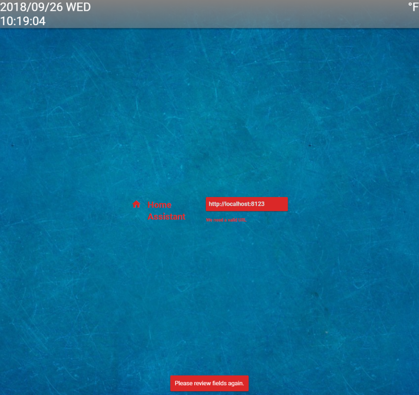
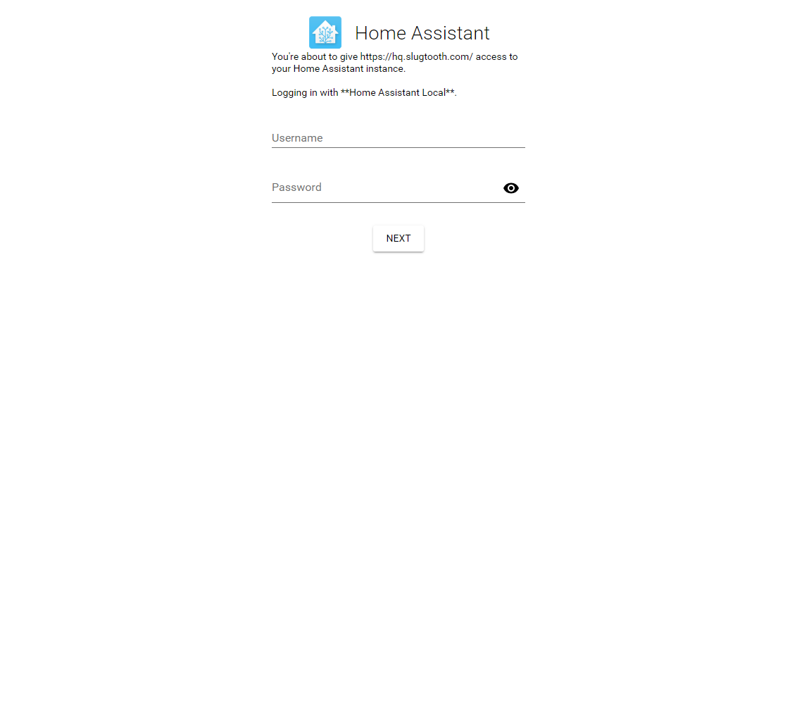
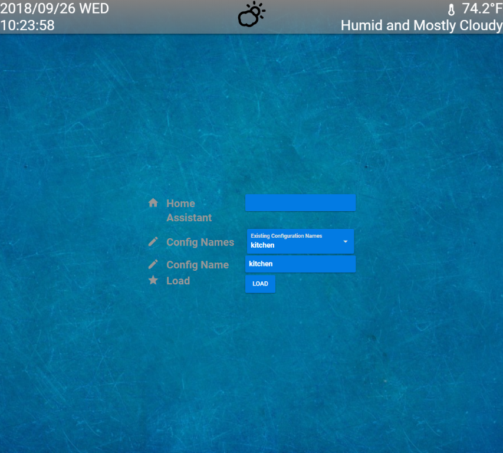
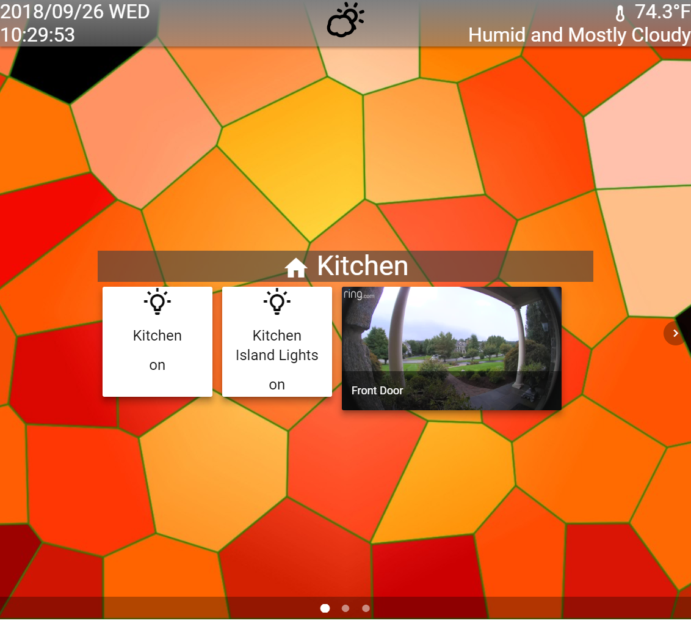
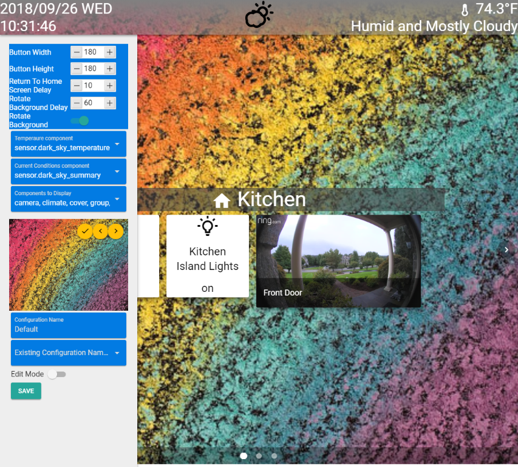
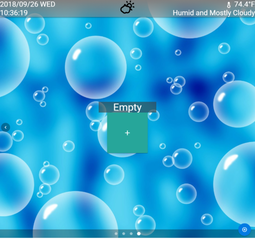

# Home Assistant Front End

## Quasar based front end

I wrote this mainly for a few tables I have around the house that I wanted a nice simple interface for. It uses the latest authentication for HASS is all client side code so it can run anywhere.

### Features
* Uses Home Assistants new authenticaion mechinism - The application never knows about your HASS credentials. Just uses tokens
* Saves config files to github gist for easy configuration - Make for very easy configuration changes. Use your PC to make changes to a config and pick that same config on your device
* Rotating Backgrounds
* Auto go to home screen - Check the weather, maybe switched a screen to close a lock, the FE will go back to the home screen for you
* Configuration - Trying to make everything customizable
* Simple framework - Quasar/Vue.js can be a little daunting to new users. I tried to make things simple to add in new components. See below on how to extend with more components
* Helpful entity browser - Hit '\\' to see this. Very helpful for developers

### Components
* Camera - Camera thumbnails and videos
* Climate - I love my nest
* Cover - Garage doors
* Group - Control groups the same as switches
* Light - On, off, brightness, color
* Sensor - No controls just shows the friendly name and state
* Switch - On, off
* Vacuum - On, Off, Battery Status
* Weather - Right now it is tied to dark sky

### Tested
Just because things are listed does not mean they wont work. If you find other's working, let me know and I will add them to the list.
* Camera - AMCrest and Ring
* Climate - Nest
* Cover - MyQ
* Group - N/A just controlled like switches
* Light - LIFX
* Sensor - Just shows state and should work with any sensor
* Switch - Zwave and others
* Vacuum - Roomba
* Weather - Dark Sky

I love ideas and other things we can do to make this better. Please let me know!

### Todos
* Camera thumbnail refreshes based off of events
* Code cleanup
* Security pad

# Installing
This uses [Quasar](https://quasar-framework.org) so if you need to install it follow their directions or:
```
yarn add vue-cli
yarn add quasar-cli
```
Clone the repo
```
git clone https://github.com/SenexCrenshaw/hass-fe.git
```
Install the app
```
cd hass-fe
yarn
quasar build -m pwa
```
You can copy everything from dist/pwa-mat to your home assistant config www directory and hit it with hassURL/local/directory-copied-to (http://localhost:8123/local/hassfe)

Or use Apache/NGINX or whatever. The root is your git directory + dist/pwa-mat and the default page is index.html

# Setup
HASS needs a custom component 'hassfe_config' for the github configuration. You can juse use a gist token but it is limited in how many api calls you can make. Adding in the username/password will give you a lot more. Usefull if you are making lots of changes. I try to keep the API calls down but you can run out with out the auth information.
In your HASS configuration directory you need to add a custom component [Custom Component](https://developers.home-assistant.io/docs/en/creating_component_index.html). Copy the sample hassfe_config.py file into your custom_components directory and make changes as needed. I also hide the config from the UI/Frontends. Check the customize.yaml sample on how to do that. Once you have the component installed, restart HASS

# Login workflow
On first login or clearing you application cache in your browswer you will be asked for your home assistant server URL. Mine is accessible from the internet with nginx so i can use a public URL. if you internal to your network enter that URL.
##Initial Page Load
<p align="center"></p>

You will be presented with your HASS login screen. Enter your credentials
##Login
<p align="center"></p>

If you have configurations already you can choose them from the drop down or type in a new name
##Choose Config
<p align="center"></p>

This config will become the default for this browser/device. This all can be changed from the config menu. Long press the date for this
##Home Screen
<p align="center"></p>

##Config screen
<p align="center"></p>

# Configuration
In the configuration screen, set edit mode and hit save
<p align="center"></p>

The plus '+' adds new components to the screen. The circled plus '+' at the bottom right will allow you to add more screens, remove a screen and make a screen the home. This will be the screen that the return to home function will use.

Most components just work with a click. For lights long press to change the color/brightness.


Im not the best writer so please bare with these docs/spelling/grammar. If you need further explanation on how this all works just ask. I will be making changes to some visual layouts.
